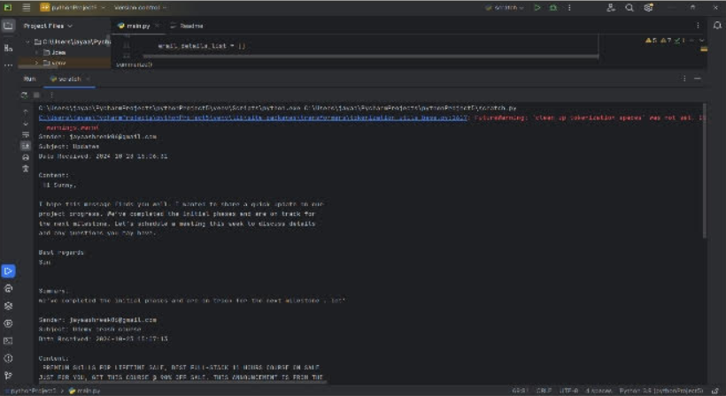

# Email to WhatsApp Automation System
## Description
This project is a Python-based automation system that extracts email data and simulates sending notifications to WhatsApp.
## Technologies Used
- Python
- IMAP (Email fetching)
- Transformers (NLP)
## Features
- Fetch unread emails from inbox
- Extract sender, subject, and content
- Summarize email using NLP
- Simulate WhatsApp notification system
## How to Run
1. Install required libraries:
   pip install transformers
2. Run the script:
   python dataextract.py
## Future Improvements
- Real WhatsApp API integration
- Web interface for user interaction
## Output

